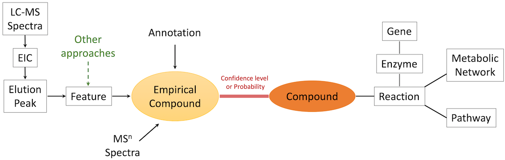

# metDataModel, data models for mass spectrometry based metabolomics

Our goal is to define a minimal set of data models to promote interoperability in computational metabolomics.
This package will lay out the basic concepts and data structures, then we can import them to other projects, and extend to more specialized classes via inheritance. 

There's been extensive software development in related areas. 
The XCMS ecosystem (https://www.bioconductor.org/packages/release/bioc/html/xcms.html) is a leading example of data preprocessing.
The modeling of metabolism is exemplified by the Escher project (https://github.com/zakandrewking/escher).
The advancing of science relies on the close interaction of experimental measurements and theoretical modeling, and the two should feed on each other. However, a clear gap exists between the two in metabolomics. E.g., the elemental mass table in Escher (retrieved on version 1.7.3) are of average mass, but mass spectrometers measure isotopic mass. 
Many software programs already have excellent data models and data structures. But the reuse of data models is much easier to start from basics, hence this project, where complexity is an option.


## Core data Structure



    metabolic model

        compound
        reaction
        pathway
        network

    experimental data model
        
        peak
        feature
        empirical compound
        experiment

Try to keep the core models minimal. 
Leave index functions in util or applications.

## Expanded data structure

    experimental data model

        massTrace: equivalent to EIC or XIC for LC-MS data
        MSnSpectrum: MS^n data to annotate peak or feature

    metabolic model

        enzyme
        gene

Peaks are extracted from massTrace.

A spectrum is a list of masses.
LC-MS is a composite of many spectra. MS^n is spectrum as product of a precursor, which is a peak.

After peaks are asigned to a feature or an empCpd, the annotation is transferred to the latter.

## Serialized empCpd format 

In JSON
 
    {"neutral_base_mass": 0, 
      "list_of_features": [
                # feature, ion, [m/z, rtime, mean_intensity]
                {'feature': '', 'ion': 'M-H[1-]', 'm/z': 169.0013, 'rtime': 55},
                {},
                # ...
            ],
      "identity": {
                # compound(mixtures): probability
                (compound x): 0.6,
                (compound y, compound z): 0.2,
        }
    }

In Python:
```
        self.neutral_base_mass = 0.0000
        self.identity_table_value = 'score' # or 'probability'
        self.identity_table = [
                  # score or probability, (compound or mixtures)
                  [0.0, ('Compound x')],
                  [0.0, ('Compound y', 'Compound z')],
          ]
        self.MS1_pseudo_Spectra = [
            {'feature': 'row23', 'ion': 'M+H[1+]', 'm/z': 169.0013, 'rtime': 55},
            {},
            # ...
        ]
```

## The mummichog suite 

This package is used in mummichog 3.

* mummichog(3): core algorithm package for pathway/network analysis

* cloud-mummichog: server and worker (RESTful) implementations

* Azimuth DB: the chemical database for biology, including metabolic models

* metDataModel: data models for metabolomics, used by mummichog and Azimuth DB

* mass2chem: common utilities in interpreting mass spectrometry data, annotation

* massBrowser: visualization using js


## For developers

This should be language neutral. We start using Python code, and it'd be the primary reference. 
But we encourage the adaptation/update/extension in other languages.

YAML should be equivalent to JSON. Since Python classes are where we started, please use them as primary reference.

Minimal JSON formats should be used for mummichog project.

We strive for the right level of abstraction.
For the core classes, it's more important to have transparent, extensible structure.
Therefore, it's a design decision not to have getter or setter functions; 
to leave out JSON methods to elsewhere;
to keep shallow data structures, which are more portable.

More abstracted, detailed, extended classess are used for more specific projects.

For end users, there has to be a serialized output at each level, which should be concise but adequate.
For developers, the classes/objects can have all details, but their presentation is on demand not by default.
I.e. be specific to what users need not what you have.

Use Wiki pages for detailed discussions of ideas.


### Related community resources
While we focus on the application of mass spectrometry data, 
many mass spectrometry data structures are defined in various software projects that focus on "pre-processing", e.g.

- openMS (https://abibuilder.informatik.uni-tuebingen.de/archive/openms/Documentation/nightly/html/index.html) 

- MSnBase (used by XCMS, https://github.com/lgatto/MSnbase)

To learn about mass spectrometry concepts and pre-processing:

- Data structure described for (py)openMS (https://pyopenms.readthedocs.io/en/latest/datastructures.html)

- XCMS tutorial by Johannes Rainer (https://github.com/jorainer/metabolomics2018)

To learn about genome scale metabolic models:

- review by Gu et al, 2019 (https://link.springer.com/article/10.1186/s13059-019-1730-3)

- our book chapter to explain metabolic models in the context of metabolomic pathway analysis (https://link.springer.com/protocol/10.1007/978-1-0716-0239-3_19)


## History

This repo was renamed from Azimuth-metabolomics. All annotation functions are moved to mass2chem package.