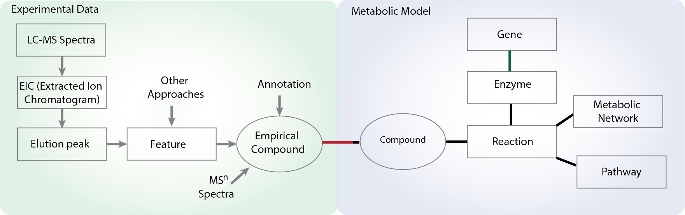

# metDataModel

Data models for mass spectrometry based metabolomics.

To define a minimal set of data models (concepts), and others can derive from them.

Python code is used as example, but this should be language neutral.

Minimal JSON formats should be used for mummichog project.

YAML should be equivalent to JSON.

## Core data Structure

    metabolic model

        compound
        reaction
        pathway
        network

    data model
        
        peak
        feature
        experiment
        empirical compound

Try to keep the core models minimal. 
Leave index functions in util or applications.

## The mummichog suite include

* mummichog(3): core algorithm package for pathway/network analysis

* cloud-mummichog: server and worker (RESTful) implementations

* Azimuth DB: the chemical database for biology, including metabolic models

* metDataModel: data models for metabolomics, used by mummichog and Azimuth DB

* mass2chem: common utilities in interpreting mass spectrometry data, annotation

* massBrowser: visualization using js

## History

This repo was renamed from Azimuth-metabolomics. All annotation functions are moved to mass2chem package.