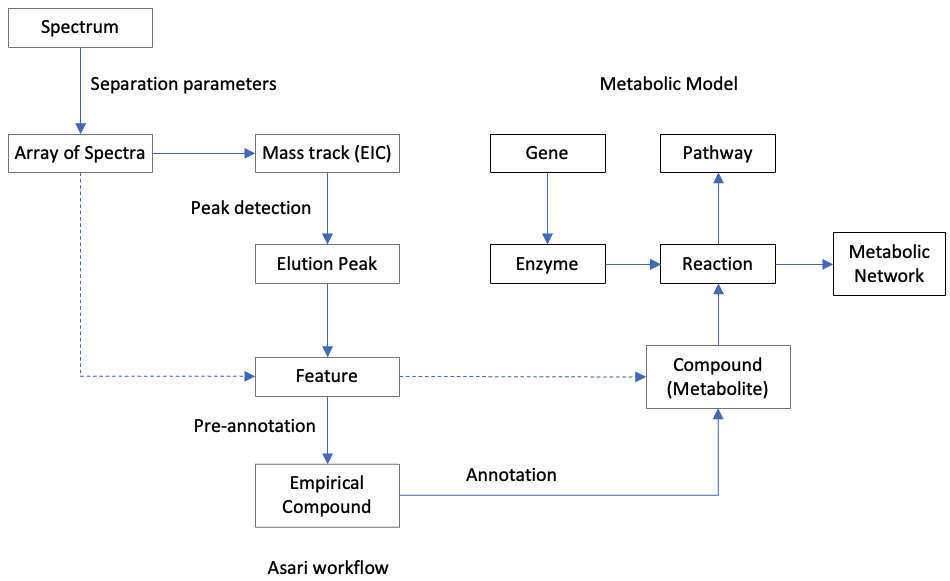

# metDataModel, data models for mass spectrometry based metabolomics

Our goal is to define a minimal set of data models to promote interoperability in computational metabolomics.
This package contains the basic concepts and data structures,
which can then be imported to other projects, and extended to more specialized classes. 

## Core data Structure

    Metabolic model:
        Compound (metabolite is compound)
        Reaction
        Pathway
        Network
        Enzyme
        Gene
    Metabolomic measurement:
        Spectrum
        Array of Spectra
        Mass track (EIC)
        Elution peak
        Feature
        Empirical compound
    Meta data:
        Study
        Experiment
        Sample
        Method

We try to keep the core models minimal. 
The index and query functions can be left to applications.

A mass spectrum is a list of m/z values with corresponding intensity values. The "Spectrum" here is generic enough for LC-MS, GC-MS, LC-IMS-MS, etc. It can be used for NMR and other technologies with minor modifications. The "Array of Spectra" is composed by linking separation parameters with spectra.

Mass track is a concept started in Asari (https://www.nature.com/articles/s41467-023-39889-1), as extracted ion chromatogram spanning the full retention time.

A peak is specific to a sample, while a feature is specific to an experiment. 

An empirical compound (empCpd) is a computational unit for a tentative metabolite, based on the experimental measurement. If the experiment does not resolve isomers, the empirical compound can be any or a mixture of the isomers. The step of assigning features to empirical compound is called pre-annotation (https://pubs.acs.org/doi/10.1021/acs.analchem.2c05810); annotation assigns compound identification to empirical compound, which accommodates different levels or probable scores. The structure of empCpd is JSON compatible and chainable (see below).

"Compound" is preferred over "metabolite", because the experimental data often contain molecules other than metabolites (contaminants, xenobiotics, etc.).

Internal structures of each class are not meant to be final. 
As long as a workflow is adhered to these core concepts, interoperability is easy to achieve.

**An alternative presentation of these concepts:**

## Serialized empCpd format (in JSON and can be implemented in any language)
 
    {
    "interim_id": "kp1832_268.0808",
    "neutral_formula_mass": 268.08077, 
    "neutral_formula": "C10H12N4O5",
    "identity": [
            {"compounds": ["HMDB0000195"], "names": ["Inosine"], 
                    "score": 0.6, "probability": null},
            {"compounds": ["HMDB0000195", "HMDB0000481"], "names": ["Inosine", "Allopurinol riboside"], 
                    "score": 0.1, "probability": null},
            {"compounds": ["HMDB0000481"], "names": ["Allopurinol riboside"], 
                    "score": 0.1, "probability": null},
            {"compounds": ["HMDB0003040"], "names": ["Arabinosylhypoxanthine"], 
                    "score": 0.05, "probability": null}
            ],
    "MS1_pseudo_Spectra": [
            {"feature_id": "FT1705", "mz": 269.0878, "rtime": 99.90, 
                    "isotope": "M0", "modification": "+H", "ion_relation": "M+H[1+]"},
            {"feature_id": "FT1876", "mz": 291.0697, "rtime": 99.53, 
                    "isotope": "M0", "modification": "+Na", "ion_relation": "M+Na[1+]"},
            {"feature_id": "FT1721", "mz": 270.0912, "rtime": 99.91, 
                    "isotope": "13C", "modification": "+H", "ion_relation": "M(C13)+H[1+]"},
            {"feature_id": "FT1993", "mz": 307.0436, "rtime": 99.79, 
                    "isotope": "M0", "modification": "+K", "ion_relation": "M+K[1+]"},
            ],
    "MS2_Spectra": [
            {"precursor_ion_mz": 269.0879, "matched_MS1_feature": "FT1705", 
            "precursor_ion_id": "269.087921142578_100.9166816170002_plasma_ID_01.mzML",
            "source": "plasma_ID_01.mzML"},
            {"precursor_ion_mz": 307.0438, "matched_MS1_feature": "FT1993", 
            "precursor_ion_id": "307.043762207031_99.3396262240002_plasma_ID_05.mzML",
            "source": "plasma_ID_05.mzML"},
            ],
    "annotation": {
            "authLib_Li_Lab_202410": [], 
            "MoNA-202402": [{
                "precursor_ion_id": "269.087921142578_100.9166816170002_plasma_ID_01.mzML",
                "reference_id": "Inosine",  "db_precursor_mz": 269.088, "db_precursor_rt": 43.44,
                "msms_score": 0.985}
            ],
            "HMDBv5": [{"accession": "HMDB0000195", "name": "Inosine"},
                {"accession": "HMDB0000481", "name": "Allopurinol riboside"},
                {"accession": "HMDB0003040", "name": "Arabinosylhypoxanthine"},
                {"accession": "HMDB0252449", "name": "Formycin b"}], 
            "CSM_r1": []   
            },
    "Databases_referred": ["CSM_r1", "HMDBv5", "MoNA-202402", "authLib_Li_Lab_202410"]
    }

An empCpd can be constructed without knowing the formula, by grouping features based on mass differences.

Experimental observations are separate from database records. They meet in the "annotation" section. 
Quantitative values for MS1 features are stored in a feature table, MS2 features in a MSP file or like.

The "identity" can be a single compound or a mixture of compounds. 
How to compute the score or probability will be dependent on external algorithms to combine information from different annotation approaches. 

Additional fields can be added as needed, e.g. alternative_formulas.

## Scientific background
There's been extensive software development in related areas. 
The XCMS ecosystem (https://www.bioconductor.org/packages/release/bioc/html/xcms.html) is a leading example of data preprocessing in R language. 
A Python ecosystem is now viable with the Asari package for preprocessing (https://www.nature.com/articles/s41467-023-39889-1).
The modeling of metabolism is exemplified by the Escher project (https://github.com/zakandrewking/escher).

The advancing of science relies on the close interaction of experimental measurements and theoretical modeling, and the two should feed on each other. However, a clear gap exists between the two in metabolomics. E.g., the elemental mass table in Escher (retrieved on version 1.7.3) are of average mass, but mass spectrometers measure isotopic mass. 
Many software programs already have excellent data models and data structures. But the reuse of data models is much easier to start from basics, hence this project, where complexity is an option.

This metDataModel package is used in:
* asari: Trackable and scalable metabolomics data preprocessing - https://github.com/shuzhao-li/asari, https://www.nature.com/articles/s41467-023-39889-1
* khipu: generalized tree structure for pre-annotation - https://github.com/shuzhao-li-lab/khipu, https://pubs.acs.org/doi/10.1021/acs.analchem.2c05810
* pcpfm: Python Centric Pipeline For Metabolomics - https://github.com/shuzhao-li-lab/PythonCentricPipelineForMetabolomics

Our mass2chem, khipu and JMS packages house the annotation functions.

## For developers

The data structures should be language neutral. 

We edit primarily in the Python code, as JSON and YAML can be exported automatically.
Each Python class has a serialization function to export JSON.

I.e., concise information for users' need is exported, but not all class details.

Adaptation/update/extension is encouraged in other languages. 

We strive for the right level of abstraction.
For the core classes, it's more important to have transparent, extensible structure.
Therefore, it's a design decision not to have getter or setter functions. 
Shallow data structures are more portable.
MetDataModel provides a template, and application projects can extend it to fit their specific needs.

There are two flavors of the metDataModel provided. The default version uses Python Dataclasses to 
enforce weak static typing. These types are recommended and not enforced at runtime, but should provide
users details to implement methods that use them in statically typed languages. The other is 
dictionary based and has no suggested types. This is the minimal model. 

Note that while metDataModel objects can have other metDataObjects as data members, this can cause 
issues if there are circular references. 

Please feel free to submit issues, and write Wiki pages for discussions.

Pypi install: https://pypi.org/project/metDataModel/

### Related community resources
While we focus on the application of mass spectrometry data, 
many mass spectrometry data structures are defined in various software projects that focus on "pre-processing", e.g.

- openMS (https://abibuilder.informatik.uni-tuebingen.de/archive/openms/Documentation/nightly/html/index.html) 

- MSnBase (used by XCMS, https://github.com/lgatto/MSnbase)

To learn about mass spectrometry concepts and pre-processing:

- Data structure described for (py)openMS (https://pyopenms.readthedocs.io/en/latest/datastructures.html)

- XCMS tutorial by Johannes Rainer (https://github.com/jorainer/metabolomics2018)

- Our asari paper https://www.nature.com/articles/s41467-023-39889-1 and documentation https://asari.readthedocs.io/en/latest/?badge=latest

To learn about genome scale metabolic models:

- review by Gu et al, 2019 (https://link.springer.com/article/10.1186/s13059-019-1730-3)

- our book chapter to explain metabolic models in the context of metabolomic pathway analysis (https://link.springer.com/protocol/10.1007/978-1-0716-0239-3_19)

### Citation

Mitchell, J.M., Chi, Y., Thapa, M., Pang, Z., Xia, J. and Li, S., 2024. Common data models to streamline metabolomics processing and annotation, and implementation in a Python pipeline. PLOS Computational Biology, 20(6), p.e1011912. (https://doi.org/10.1371/journal.pcbi.1011912)
